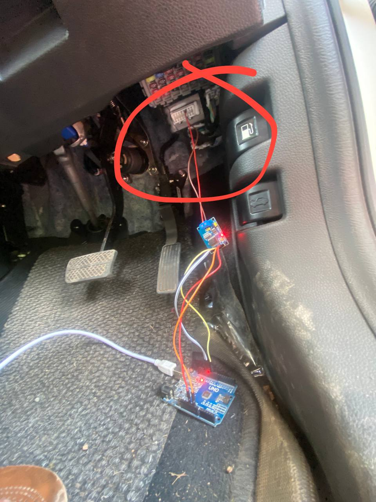
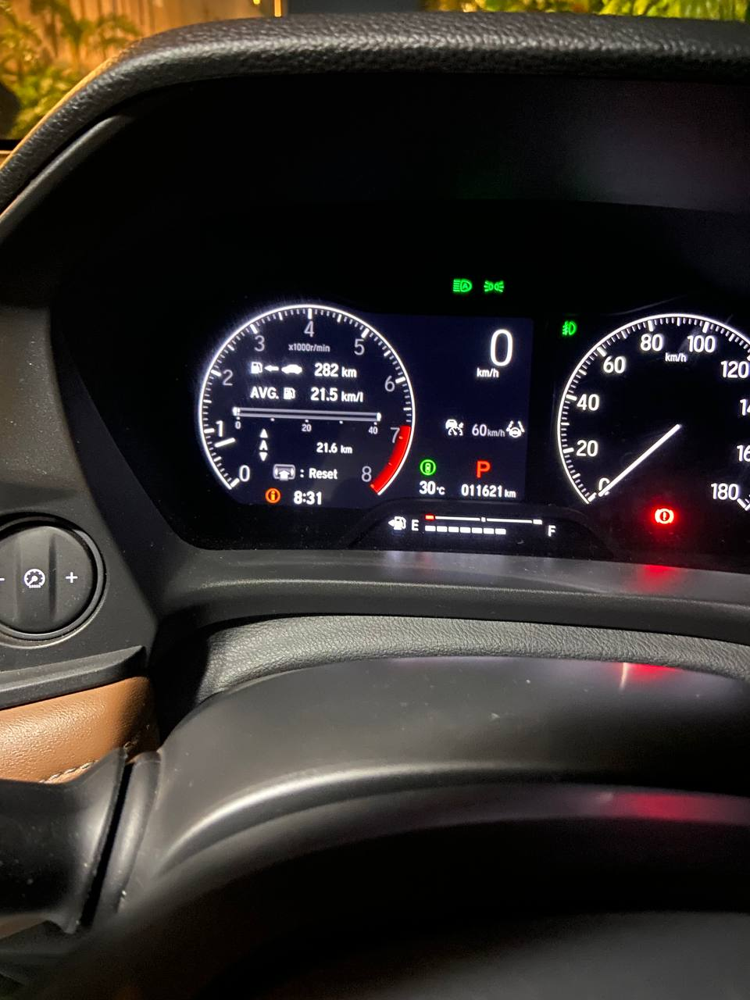

It all started with me trying to turn on the external light's of my car when i turn on lowbeam light's without tampering with any wires

So i started sniffing the data from can bus, Soon enough i realised if i send the any data with low arbitration id i can make the car excute my data bytes as lower id get's priority.

What i am able to acheive ?

Fix the damm ACC !(The Adaptive cruise control is too agrasive, it accelarate the car too quickly by default)

Remove the god damm disclaimer. (I don't understand why the fuck i have to click okay everytime i turn on my car.)

Turn on my external light's.(Yes this is the last thing i did)

Working on 

Also able to steer with my laptop. (I am working on making it work completely with openpiolot)

Get the stream from adas camera.

Other stuff i forgot :(

 

After setting up the acc. My car's milage also increased.

Device used ?
Nothing crazy, cheap 

-Arduino uno

-Mcp5215 

-obd2 male plug (Just to make it look nice)

Oh i am doing all this on honda elevate top varient .

