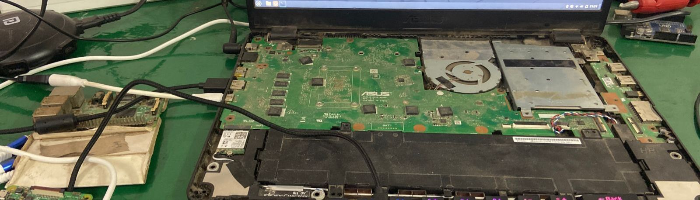

I run many life improving services on my home server's.
This list will be updated as i add new service (Simple script to pick up new stuff and add it. Don't worry it ask's me if i wanna push it)

-Jellyfin (Jellyfin is a Free Software Media System that puts you in control of managing and streaming your media.)

-NextCloud (Nextcloud is an open source, self-hosted file share and communication platform.)

-Radarr (See all your upcoming movies in one convenient location. Manual Search Find all the releases, choose the one you want and send it right to your download client.)

-Sonarr (Like radarr but for tv series)

-Transmission( Torrent client)

-JackettAPI Support for your favorite torrent trackers )

-HomeBridge (Homebridge allows you to integrate with smart home devices that do not natively support HomeKit)

-TailScale(Vpn mesh)

